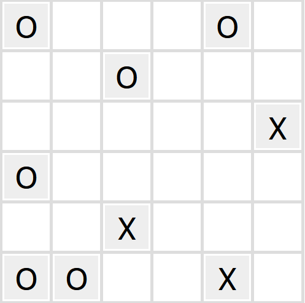

# Binario
___
### Tobiáš Salva

### Vysvětlení pravidel

Hraje se na čtvercovém hracím poli se sudou výškou a šířkou $n$.
Některá políčka jsou předem vyplněna jedním ze dvou symbolů.
Zde předpokládám, že jsou to sybloly `X` a `O`,
nicméně to můžou být i třeba černé a bílé body, je to jedno. 

Úkolem je pak vyplnit zbývající políčka právě jedním z dvou symbolů
v souladu s následujícími třemi pravidly:

1.  Na každé řádce a na každém sloupci musí být
stejně symbolů `X`, jako symbolů `O`. (Řádka `XXOX` je nelegální)  
1. Nesmí být více než dva stejné symboly v řadě nebo ve sloupci
hned za sebou. (Řádka `XXXOOO` je nelegální)
1. Žádné dva řádky ani žádné dva sloupce nesmí být identické,
co se pořadí symbolů týče.

### Spuštění programu

`./binario_puzzle.py [-i INPUT] [-o OUTPUT] [-s [OPERATING-SYSTEM] [-v {0,1,2}]`

- `OUTPUT` je soubor mezivýsledku ve formátu DIMACS CNF,
na který je následně zavolán Glucose SAT solver (default `"output.cnf"`)
- `OPERATING-SYSTEM` bere buď hodnotu "win" nebo "unix". Jde o to,
že jiné architektury využívají trochu jinou verzi solveru. (default `"win"`)
- `-v` Výřečnost samotného solveru. Když je > 1, na stdout
se vypíše lidsky čitelné řešení. 
- `INPUT` Vsupní soubor, viz dole...

#### Formát vstupu
Program potřebuje na vstupu soubor, jehož formát vyžaduje,
aby měl na každém řádku sudé $n$ symbolů `X`, `O`, nebo 
prázdný symbolů `_`
a takových řádků bylo taky $n$. Soubor může a nemusí končit
jedním prázdným řádkem. 
V adresáři projektu je podadresář `/puzzle_instances`,
který obsahuje několik předem připravených instancí ve
spravném formátu.

### Kódování do CNF
Kódování logických proměnných je velice prosté.
Stačilo implementovat matici $n*n$, kde proměnná na pozici $i,j$ říká,
že na pozici $i,j$ hracího pole je symbol `X`. Píšu $p_{i,j}$.
Negace tohoto výroku říká, že na pozici je `O`.

Při implementaci samotných pravidel vše rovnou generuji jako CNF klauzule,
které pak spojuji, než abych tvořil složitější ale kratší výrok
a ten pak stejně musel do CNF upravit.

## Generování pravidel

### Zakódování samotné instance
Stačí k výslednému CNF připojit jednotkové klauzule,
obsahující buď $p_{i,j}$, nebo $\neg p_{i,j}$, podle toho,
jestli je na vstupu na dané pozici expllicitní symbol.
Když na pozici je akorát `_`, daný literál v tomto kroce vynecháme.

### Zakódování 1. pravidla
Bohužel ve světě výrokových proměnných nelze úplně dobře počítat,
kolik je jich pravdivých a kolik ne.
Řešení je buď vypsat všechny legální kombinace bodů v konkrétní řádce/sloupci,
nebo naopak zakázat všechny nelegální.
Já zvolil druhou možnost.

Je to z důvodu, že když bych chtěl například zakázat řádku `OOOX`,
můžu napsat výrok $\neg(p_1 \land p_2 \land p_3 \land \neg p_4)$,
což se dá přepsat jako $(\neg p_1 \lor \neg p_2 \lor \neg p_3 \lor p_4)$. 
Tyto výrazy se spojují do disjunkcí a výraz je tak rovnou v CNF.

Všech kombinací na jednom řádku je $2^n$. Všech legálních je ${n}\choose{n/2}$.
Dohromady pro celé hrací pole tedy $(2^n - {{n}\choose{n/2}})*2n$
klauzulí, každá s $n$ literály.

### Zakódování 2. pravidla
To nejlehčí. Stačí pro každé tři body vedle sebe chtít, aby se lišily.

Logicky zapsáno $(p \lor q \lor r) \land (\neg p  \lor \neg q \lor \neg r)$.

Pak stačí tyto klauzule napsat pro všechny body ve všech řádkách a sloupcích.

Dohromady $4*n(n-2)$ klauzulí o $3$ literálech.

### Zakódování 3. pravidla:

Pravidlo interpretuji jako : $\forall$ řádky/sloupce platí: 
alespoň jeden pár proměnných na stejné pozici se nerovná.

Nerovnost dvou proměnných kóduji jako:
$p \neq q \approx (p \lor q) \land (\neg p \lor \neg q)$.

Všechny páry proměnných takto v závorkách spojím do disjunkce.
$p_\*$ je jeden řádek, $q_\*$ je jiný řádek.

$$\bigvee_{i=1}^{n} ((p_{i} \lor q_{i})
\land (\neg p_{i} \lor \neg q_{i}))
=
((p_{1} \lor q_{1}) \land (\neg p_{1} \lor \neg q_{1})) \lor
((p_{2} \lor q_{2}) \land (\neg p_{2} \lor \neg q_{2})) ...$$ 

Následně substituuji $(p_{1} \lor q_{1})$ za $a_1$, 
$(\neg p_{1} \lor \neg q_{1}))$ za $b_1...$
A dojdu k výroku: 

$$
\bigvee_{i=1}^{n} (a_i \land b_i)
$$

Platí že:
$
(a_1 \land b_1) \lor (a_2 \land b_2) \approx
(a_1 \lor a_2) \land (a_1 \lor b_2) \land
(b_1 \lor a_2) \land ( b_1 \lor b_2)
$

Tudíž pomocí distributivity prohodím vnější disjunkce dovnitř
a konjunkce ven.
Tím vytvořím ekvivalentní výrok v CNF.

Tuto distibuci lze dělat donekonečna,
nicméně počet klauzulí roste exponenciálně.

Pomocí těchto úprav lze finální výrok generovat jako:
$$
\bigwedge \left\{
(x_1 \lor x_2 \lor ...x_n) 
\mid
x_i \in \left\{ a_i, b_i \right\}
\right\}
$$
Aneb všechny kombinace klauzulí, kdy v každé je vždy právě $a_i$ nebo $b_i$
Následná zpětná substituce nedělá problém, jelikož původní výraz
je disjunkce, kterou vkládám do dalších disjunkcí.

Původní velká disjunkce měla $n$ vnitřních členů,
kde každý člen obsahoval $4$ literály.
Výsledný CNF výrok bude mít $2^n$ klauzulí, každou s $2n$ literály.
Dohromady pro celou tabulku $2^{n+1}*n(n-1)$ takových klauzulí.

Tento konkrétní zápis 3. pravidla přímo vybízí k využití rekurze, což jsem udělal.

V celku, (jestli správně počítám
)